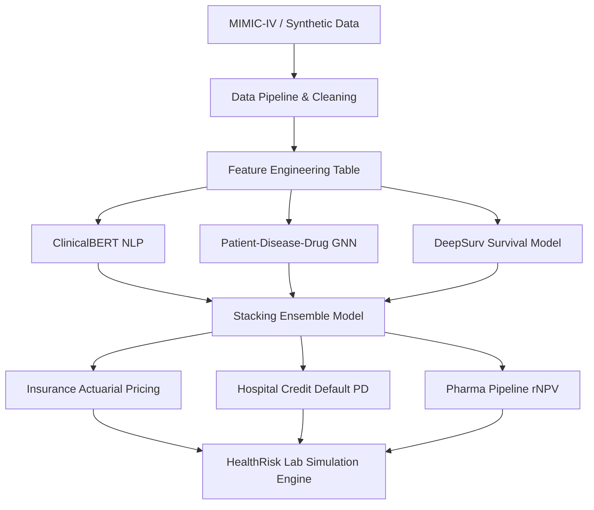

# 01. Technical Architecture

HealthRisk AI is structured as a dual-domain platform that bridges clinical intelligence with financial risk models. The system is designed to consume medical, epidemiological, and molecular data, preprocess it via structured pipelines, model clinical trajectory dynamics, and embed these signals directly into financial assets and portfolio decisions.

## System Components

### 1. Data Pipeline & Preprocessing (`src/data_pipeline/`)
- **Ingestion (`ingestion.py`)**: Fetches clinical cohort tables, FDA adverse events, WHO epidemiology data, and clinical trial records.
- **Cleaning & Imputation (`features.py`)**: Filters lab outliers using physiological ranges, standardizes ICD codes, and imputes missing numeric records using median fallback strategy.
- **Generator (`synthetic_data.py`)**: Mimics MIMIC-IV clinical databases and financial structures for testing and development.

### 2. Clinical NLP Layer (`src/clinical_nlp/`)
- Fine-tuned **ClinicalBERT** performs entity extraction (NER) and patient comorbidity complexity analysis on textual clinical discharge notes.
- Extracts patient diagnoses, treatments, and negation patterns to infer complexity scores beyond structured tables.

### 3. Graph Neural Network Layer (`src/graph_nn/`)
- Constructs a heterogeneous graph linking patients, ICD-10 diagnoses, and drug regimens.
- Uses a **3-layer Graph Attention Network (GAT)** with multi-head attention and residual connections to produce patient embeddings capturing relational risk factors.

### 4. Survival Analysis Layer (`src/survival/`)
- Utilizes **Cox Proportional Hazards** and **DeepSurv** (neural network Cox extension) to model time-to-event curves.
- Predicts time-to-readmission for clinical monitoring and time-to-covenant-breach for hospital financial credit models.

### 5. Stacking Ensemble Meta-Learner (`src/ensemble/`)
- Blends predictions from tabular models (XGBoost, LightGBM), ClinicalBERT note embeddings, GNN graph embeddings, and survival hazards.
- Uses a logistic regression meta-learner to predict 30-day readmissions, maintaining strict time-aware cross-validation to prevent target leakage.

### 6. Financial Risk Application Layers (`src/financial/`)
- **Actuarial Pricing**: Stratifies risk categories and utilizes generalized linear models (GLM) for insurance premiums and IBNR loss reserve estimation.
- **Credit Risk Scorecard**: Uses clinical indicators (star ratings, boarding hours) to adjust default probability scorecards for hospital municipal bonds.
- **Pharma rNPV**: Runs Monte Carlo simulations using trial success probabilities to value pharmaceutical R&D pipelines.

### 7. Interactive Simulation Engine (`src/simulation/`)
- The game engine drives the **HealthRisk Lab**, running players through scenarios (epidemics, CMS rate cuts) and measuring outcomes against an AI decision opponent.
